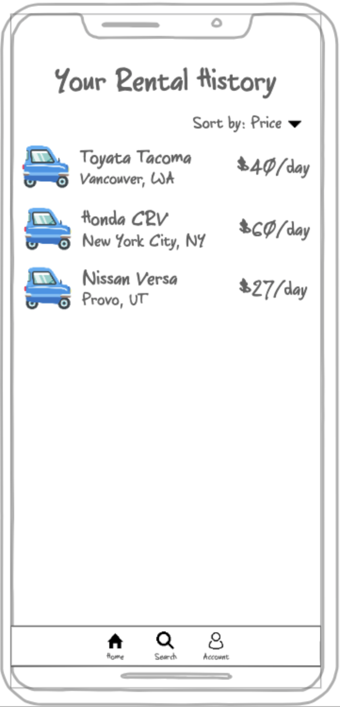
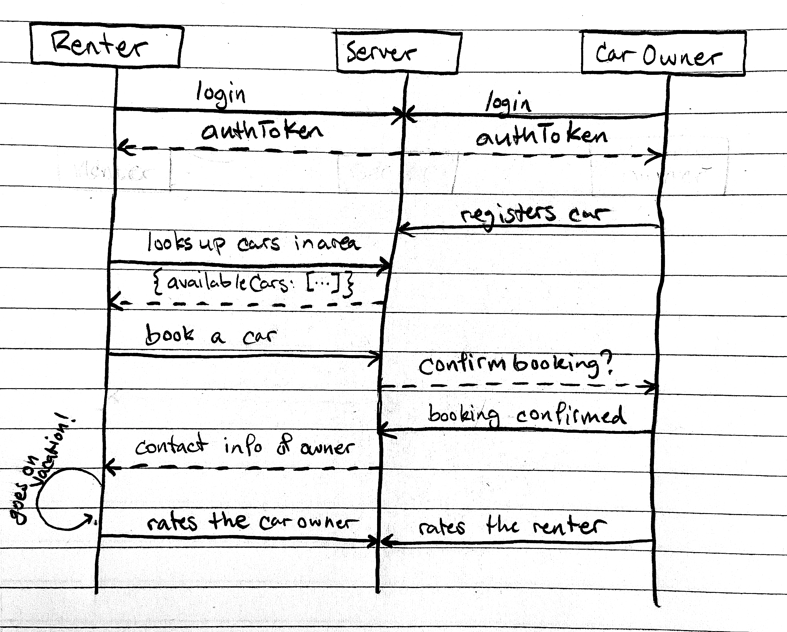

# Startup
CS 260 Startup

## Notes found [here](notes.md)

## Elevator Pitch
Rental cars are too expensive! Pockettowns is a new way of getting your hands on a vehicle while you're travelling. Similar to Airbnb, users will register their cars as rentable, and when you come to a new destination, travellers will look at the available listings for that area! They'll connect with the vehicle owners, and borrow their car for the duration of their trip. Travelling has never been easier!

## Mock Up
Main Page Design of the web application

    
    
    
    

This is the sequence diagram of how the different users communicate with the server

## Key Features
* Secure login over HTTPS
* Extracts and Displays data about available cars around your area
* Registration of a car for possible travelers in your area
* Real time communication with a booked renter
* Ratings of all the renters and of the cars as they are rented

## Technologies
I will use the required technologies in the following ways
* **HTML** - There are four HTML pages in this application: Sign up/Login, Car Registering, Available Listings, & Car rental History
* **CSS** - The pages will all be styled using CSS to make sure that the application looks good on all sizes of device.
* **JavaScript** - Displays all the available listings recieved from the backend, as well as all the user data. Also provides the login capabilities
* **Service** - There will be backend endpoints for
    * Logging in
    * Available Listings Retrieval
    * Car Registration
    * Account Info Retrieval
* **DB** - We will store the account data for each account in a database in the cloud (username, password, history, location, cars registered)
* **Login** - Each user will have to login with their own unique credentials stored in the cloud.
* **Web Socket** - When a car in rented, the renter will be connected to the vehicle owner
* **React** - Application will later be based on React
