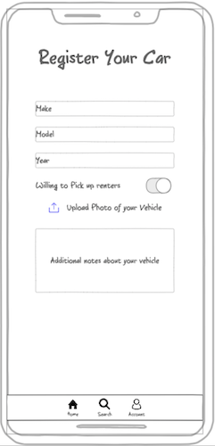

# Startup
CS 260 Startup

## Notes found [here](notes.md)

## Elevator Pitch
Rental cars are too expensive! Pockettowns is a new way of getting your hands on a vehicle while you're travelling. Similar to Airbnb, users will register their cars as rentable, and when you come to a new destination, travellers will look at the available listings for that area! They'll connect with the vehicle owners, and borrow their car for the duration of their trip. Travelling has never been easier!

## Mock Up

