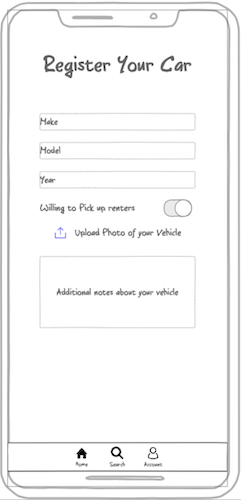
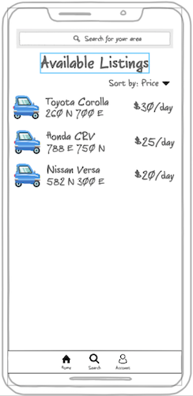
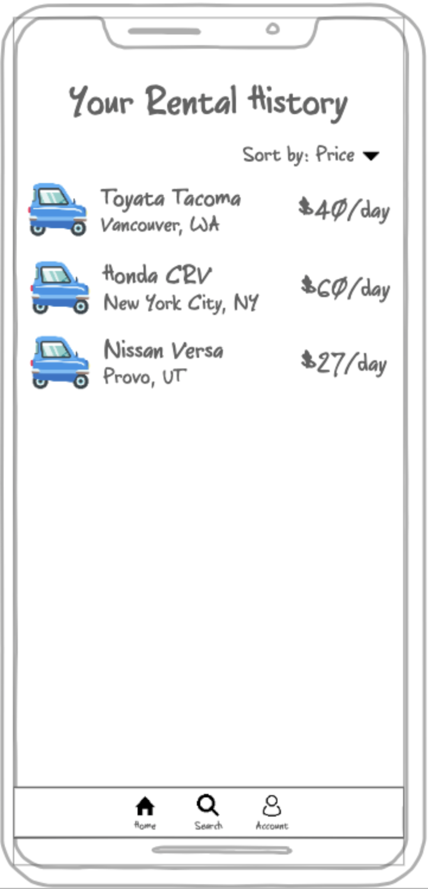
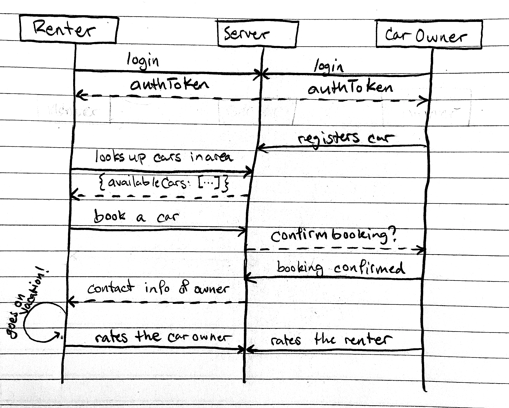

# Startup
CS 260 Startup

## Notes found [here](notes.md)

## Elevator Pitch
Rental cars are too expensive! Pockettowns is a new way of getting your hands on a vehicle while you're travelling. Similar to Airbnb, users will register their cars as rentable, and when you come to a new destination, travellers will look at the available listings for that area! They'll connect with the vehicle owners, and borrow their car for the duration of their trip. Travelling has never been easier!

## Mock Up
Main Page Design of the web application

    
    
    
    

This is the sequence diagram of how the different users communicate with the server

## Key Features
* Secure login over HTTPS
* Extracts and Displays data about available cars around your area
* Registration of a car for possible travelers in your area
* Real time communication with a booked renter
* Ratings of all the renters and of the cars as they are rented

## Technologies
I will use the required technologies in the following ways
* **HTML** - There are four HTML pages in this application: Sign up/Login, Car Registering, Available Listings, & Car rental History
* **CSS** - The pages will all be styled using CSS to make sure that the application looks good on all sizes of device.
* **JavaScript** - Displays all the available listings recieved from the backend, as well as all the user data. Also provides the login capabilities
* **Service** - There will be backend endpoints for
    * Logging in
    * Available Listings Retrieval
    * Car Registration
    * Account Info Retrieval
* **DB** - We will store the account data for each account in a database in the cloud (username, password, history, location, cars registered)
* **Login** - Each user will have to login with their own unique credentials stored in the cloud.
* **Web Socket** - When a car in rented, the renter will be connected to the vehicle owner
* **React** - Application will later be based on React

## HTML Deliverable
For this deliverable, I added these things to my startup
* **HTML pages** - All the pages of the application are added using HTML code
* **Links** - The links at the top of the page, as well as the link to my GitHub repository are functioning
* **Mock Service Options** - There are mock services shown in the screens of the application
* **Login** - Input boxes and submit button for login.
* **Database** - There is user data and Service options that will be updated using the database
* **WebSocket** - The realtime connection with the server will be done with the messaging page

## CSS Deliverable
I have changed some things about the way the app works. First and foremost, the app is no longer about cars, but instead about generic services that people can offer in the city they live in. Also, instead of a Messaging screen, I have created an Account settings screen. In this screen, we'll establish a web socket to give the user possible ideas of services to think about registering.

For this deliverable, I made the application look better!
* **Header, footer, and main content body**
* **Navigation elements** - All the parts in the nav element look good, and show a bottom border when hovered over
* **Responsive to window resizing** - As you make the window larger or smaller, the text fields and the placement of the elements shifts around
* **Application elements** - There is a good understanding of what is the main body and what is the header and footer
* **Application text content** - Everything is in Arial or Sans serif to give it a modernized, not-to-complex look
* **Application images** - All the images are sized correctly and are shown in a stylized way

## Javascript Deliverable
For this deliverable, I added the following JavaScript functionality:
* **Support for Future Login**
* **Support for a Database** - I used dummy data to be returned, but the database functions are now in place.
* **Support for a future WebSocket** - The web socket will be used with the messaging between the service owner and the service user. (Not sure exactly how that is going to work yet, but the structure is as best I could do).
* **Application is Interactive** - all the sorting dropdowns now work, and going from one place to another is working as intended.

